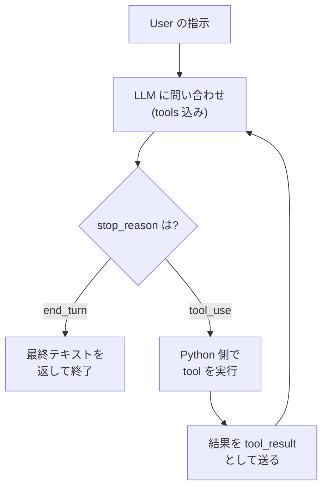

# agent-harness-minimal

エージェントハーネスの **最小実装** です。LLM が tool を使って自律的に作業する
仕組みの「本質だけ」を、コードと丁寧なコメントで定義しています。

## なぜこれを作ったか

Claude Code / Managed Agents / LangChain / AutoGPT などの
エージェントシステムは、どれも複雑で、本質と装飾の区別が付きにくくなっています。
**「ハーネスの本質は実は小さい」** ことを示すために、余計な抽象化・依存・
フレームワークを全部削ぎ落とした最小実装を残します。

実コードは 50 行以下。残りはすべてコメントです。

## ファイル

| ファイル | 役割 | 行数 (実コード) |
|---|---|---|
| `harness.py` | ハーネス本体 (4 ステップループ) | ~50 |
| `example.py` | 2 つのツールを使う動作例 | ~30 |
| `requirements.txt` | 依存パッケージ | 1 |
| `README.md` | この docs | — |

## エージェントハーネスとは何か (1 図で)



これが全て。`harness.py` の `run_agent()` 関数 1 個でこの図を実装しています。

## クイックスタート

```bash
# 1. 仮想環境を作る (推奨)
cd agent-harness-minimal
python -m venv .venv

# Windows PowerShell の場合:
.venv\Scripts\Activate.ps1
# Git Bash の場合:
source .venv/Scripts/activate

# 2. 依存をインストール
pip install -r requirements.txt

# 3. API key を設定
# PowerShell の場合:
$env:ANTHROPIC_API_KEY="sk-ant-..."
# Bash の場合:
export ANTHROPIC_API_KEY="sk-ant-..."

# 4. 実行
python example.py
```

## 期待される出力

`example.py` は LLM に「今から今日の終わりまで何分あるか教えて」と聞きます。
LLM は次のように **自分で判断して** ツールを使います:

```
======================================================================
  agent-harness-minimal: example run
======================================================================

[user] 今から今日の終わり (24:00 JST) までちょうど何分あるか教えて。計算過程も簡単に説明して。

─── iteration 1 ───
  [tool_use] get_current_time({})
  [tool_result] 2026-04-09T15:30:00+09:00

─── iteration 2 ───
  [tool_use] calculate({"expression": "(24 - 15) * 60 - 30"})
  [tool_result] 510

─── iteration 3 ───
[end_turn] final answer:
今は 15:30 なので、24:00 まであと 510 分です。
計算: (24 - 15) × 60 - 30 = 540 - 30 = 510 分

======================================================================
  最終回答:
======================================================================
今は 15:30 なので、24:00 まであと 510 分です。
計算: (24 - 15) × 60 - 30 = 540 - 30 = 510 分
```

## 学べること

このハーネスを読むと次が分かります:

1. **エージェントは特別な存在ではない** — LLM API + ループ + 関数の dict だけ
2. **ツールの実体は普通の Python 関数** — 装飾子も継承も要らない
3. **フローを Python 側で書かない** — 順序は LLM が prompt と tool description
   から自分で判断する
4. **assistant の content をそのまま履歴に append する** ことの重要性
   (ここを省略すると tool_use_id が解決できなくなる)
5. **tool_result は user role で返す** という Anthropic API の対称構造

## 大型システムとの関係

Claude Code も、Managed Agents も、
中心にあるのはすべて `run_agent()` と本質的に同じループです。違うのは:

| 機能 | このハーネスの場合 | 大型システムの場合 |
|---|---|---|
| ツール数 | 2 個 (時刻 / 計算) | 数十〜数百 (file ops / web / MCP / カスタム…) |
| ロール数 | 1 個 (single agent) | 多数 (Concept / Engineer / Reviewer / …) |
| Context 管理 | 単純 append | 圧縮 / cache / summarization |
| ロール間連携 | なし | hand-off / Best-of-K / Reviewer 独立 / 並列 |
| Permission | bypass (tool 全許可) | always_ask / always_allow を per-tool 制御 |
| Resume | できない | session 単位で resume / fork |
| Observability | print のみ | tracing / events.jsonl / metrics |

これらは全部 **「中心ループの外側に乗っかる装飾」** です。本質は変わりません。
だからこのハーネスを読めば、大型システムの設計判断を「装飾としてどれを足すか」
の問題として理解できるようになります。

## ライセンス

なし (パブリックドメイン的に自由に使ってください)。
